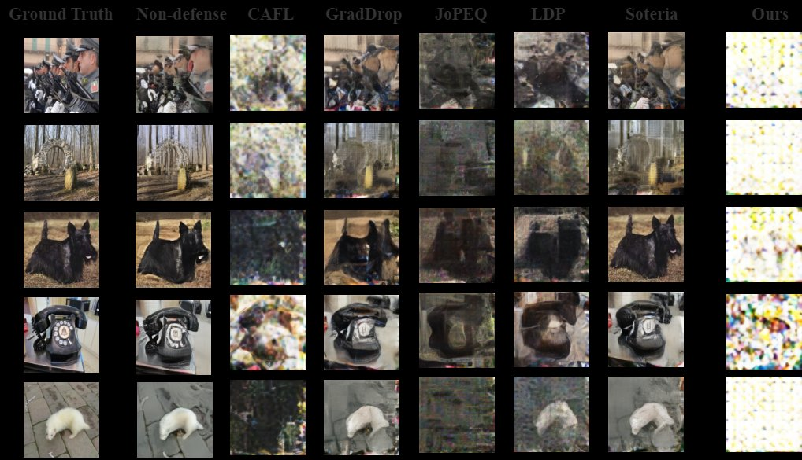

### Leakage-Resilient and Carbon-Neutral Aggregation Featuring the Federated AI-enabled Critical Infrastructure

Here, we implement CDPA against ROG attacks.

#### Prerequisites for defensing ROG attack

- install Python packages
    ```bash
    pip install -r requirements.txt
    ```
- Download the pretrained models and put them under `model_zoos` ([link](https://huggingface.co/erickyue/rog_modelzoo/tree/main)) （These models retrived from ROG attack）

- The images for a minimal runnable example has been included under `data` folder. The ImageNet validation dataset can be used for a full test.   

- Run the example with FedAvg:
    ```bash
    python attack_fedavg.py
    ```
    The script will load the configuration file `config_fedavg.yaml`. 


    You can change the settings in the configuration file. 

#### Prerequisite for utility experiments
1. PyTorch=1.8.0: https://pytorch.org
2. scipy
3. tqdm
4. matplotlib
5. torchinfo
6. TensorboardX: https://github.com/lanpa/tensorboardX
- For utility experiments:
please go to the utility folder, run
    ```bash
    python main.py
    ```
